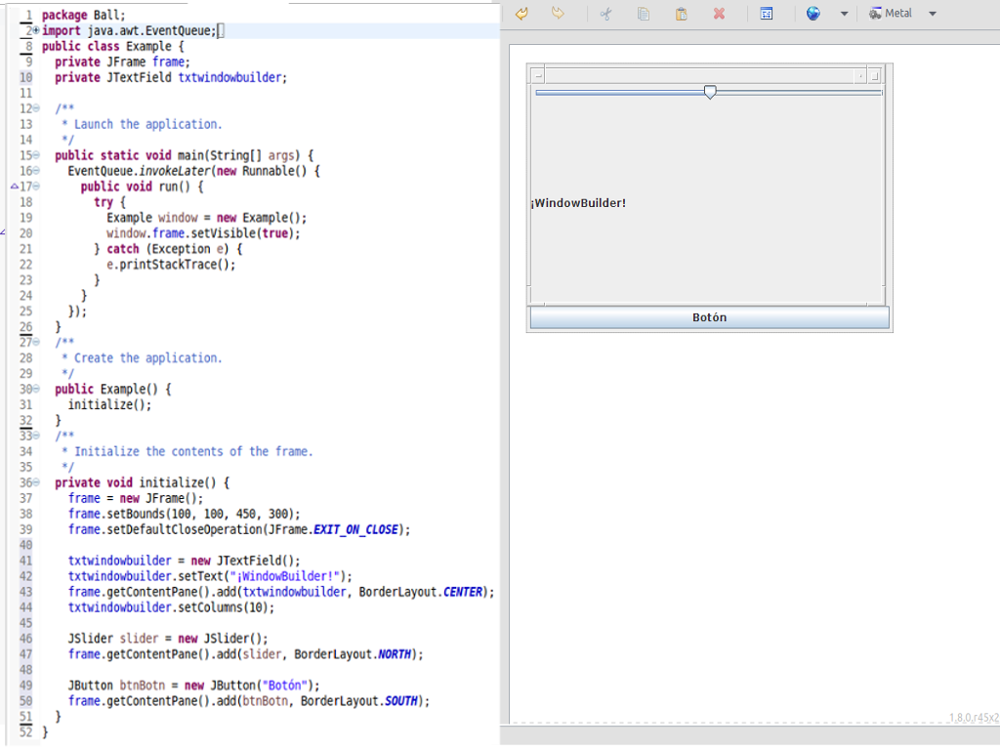
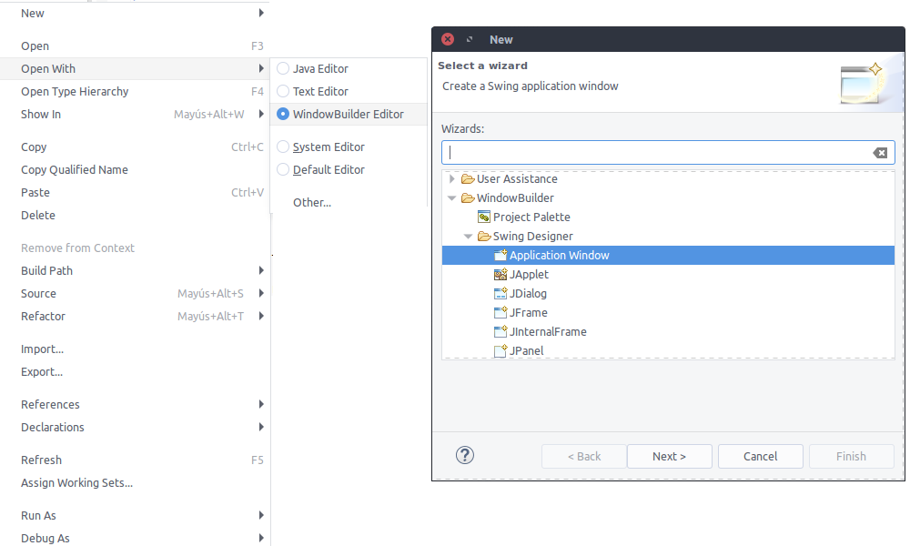
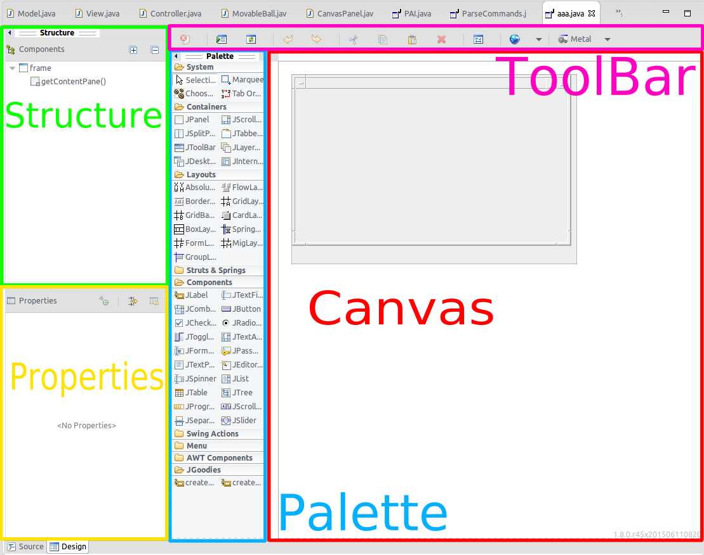
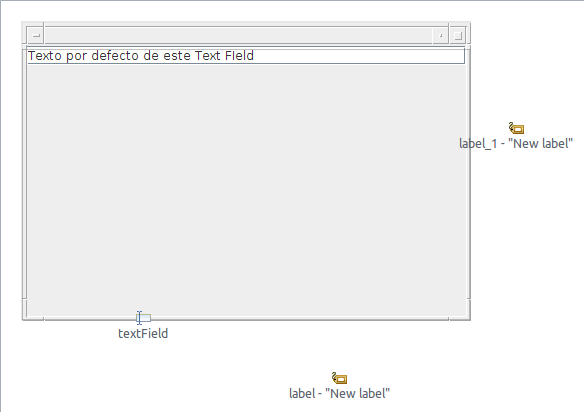
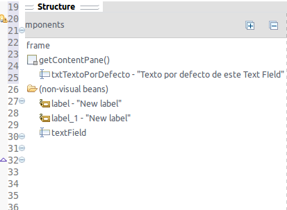
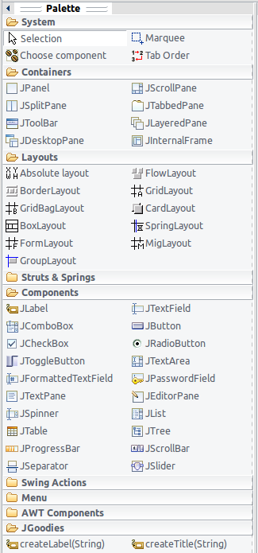
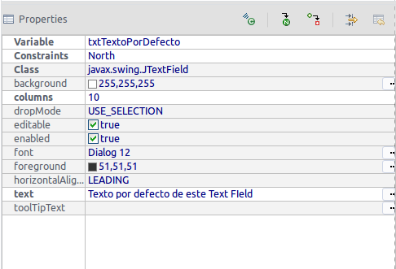

# Diseño de interfaces en java mediante herramientas visuales

# Índice

<!-- MarkdownTOC depth=3 -->

- [¿Qué ofrecen estas herramientas?](#¿qué-ofrecen-estas-herramientas)
    - [¿Qué herramientas existen y cuales vamos a ver?](#¿qué-herramientas-existen-y-cuales-vamos-a-ver)
    - [WindowBuilder](#windowbuilder)
        - [Cómo funciona](#cómo-funciona)
        - [Cómo se crea un proyecto](#cómo-se-crea-un-proyecto)
        - [Distribución de pantalla](#distribución-de-pantalla)
        - [Canvas](#canvas)
        - [Components](#components)
        - [Paleta](#paleta)
        - [Properties](#properties)
        - [Opciones de los elementos](#opciones-de-los-elementos)
        - [ToolBar](#toolbar)
        - [Window > Preferences > WindowBuilder](#window--preferences--windowbuilder)
    - [IntelliJ](#intellij)
        - [Cómo funciona](#cómo-funciona-1)
        - [Creacion de GUI](#creacion-de-gui)
        - [Intellij Designer](#intellij-designer)
        - [Traducciones](#traducciones)
        - [Configuración del Designer de Intellij](#configuración-del-designer-de-intellij)
- [Conclusiones](#conclusiones)
    - [Bibliografía y Enlaces](#bibliografía-y-enlaces)

<!-- /MarkdownTOC -->

## ¿Qué ofrecen estas herramientas?
Programar interfaces gráficas es un trabajo tedioso y que requiere testeo
contínuo para comprobar que el resultado es exactamente el que buscamos.

Para facilitar esta tarea existen diversas herramientas que nos permiten modelar la interfaz de forma visual para posteriormente generar el código de las mismas así como testear únicamente componentes individuales (JPanel) etc.  

## ¿Qué herramientas existen y cuales vamos a ver?
- Incluidas en IDE's
    - IntelliJ
    - NetBeans
- Complementos
    - WindowBuilder
    - SceneBuilder (JavaFX) [^2]

Hay una gran diversidad de herramintas disponibles; las dos primeras junto con JavaFX codifican la interfaz usando XML.
IntelliJ puede importar proyectos de NetBeans que usen GUIs. Esto no lo he probado de primera mano.
Windows builder trabaja directamente con el codigo. Comentar que javaFX es todo un conjunto de librerías nuevas incluidas desde
la version 1.8 de java. La cual esta enfocada en hacer interfaces mobiles y modernas. Es el reemplazo de Swing. JavaFX en este caso
usa SceneBuilder para editar los archivos FXML que representan la interfaz. El cual es indenpendiente del editor de texto.

Hemos optado por elegir IntelliJ y WindowBuilder debido a que emplean dos filosofías distintas pero siendo ambos muy sencillos de utilizar y trabajando sobre objetos swing.

---

## WindowBuilder

### Cómo funciona
WindowBuilder genera a tiempo real el código fuente de la interfaz y de forma retroalimentada, es decir, los cambios que realicemos tanto en el código como en el designer se verán reflejados en el otro.

Esta funcionalidad que requiere de que el código Java sea parseado presenta sin embargo una serie de problemas asociados que procedemos a exponer a continuación:

- El código generado no siempre cumple los estándares de estilo del lenguaje:
    + No se generan constantes; lo parámetros numéricos que necesiten los métodos de los objetos están codificados en su misma llamada y no como variable.
    + De toda la jerarquía de elementos gráficos creada solo se generara la clase que actúe como raíz y el resto de componentes serán instanciados e inicializados en un método initialize.
- Por defecto los objetos no pertenecen a la clase sino al método. Solo el JFrame principal sí es un atributo private de la clase. Esto se modifica mediante a opción field to local / local to field. (EN PROPERTIES)
- La correcta visualización de la interfaz depende de que el código pueda compilar de forma correcta, es decir, si nuestro código contiene errores el designer nos mostrará un error de parseo.

### Cómo se crea un proyecto

1. Nuevo > Other > WindowBuilder > Swing Designer  
    - Application Window
    - JApplet
    - JDialog
    - JFrame
    - JInternalFrame
    - JPanel
5. Nombre de la clase
6. Pestaña inferior, Design

También podemos elegir una clase con elementos gráficos ya creada y
Click derecho > open with WindowBuilder Editor

### Distribución de pantalla

4 Paneles principales.

- Canvas
- Palette
- Structure
    + Components
    + Properties
- Barra de herramientas

### Canvas
Muestra la interfaz que se está construyendo. Permite seleccionar varios elementos a la vez y redimensionarlos / moverlos de una forma intuitiva.

Además puedes añadir elementos fuera del JFrame y estos se crearán como atributos final private de la clase

### Components
Muestra una representación en árbol de los elementos según la jerarquía de contenedores / layouts de la propia interfaz.

Permite arrastrar y soltar por el árbol para reordenar elementos

### Paleta
Muestra todos los elementos instanciables organizados por carpetas según su tipo (layouts, containers etc.)

Es modificable no sólo a nivel visual y organizativo (como se muestran los elementos y en qué categorías) si no permitiendo también importar componentes creados por nosotros mismos.

- Importar / Exportar Paleta
- Importar clases desde un .jar
- Crear static factory / instance factory

El primer campo contiene las herramientas de selección de elementos:
- Selección normal
- Selección de área
- Choose component. Permite buscar por clase de elemento
- Tab order

### Properties
- Show events: Permite añadir un listener concreto al objeto. Para ello
te lleva al código de la clase habiendo creado una clase anónima que recibe el evento
- Goto definition
- Convert Local / Field: Pasa a considerar un elemento como atributo privado de la clase
- Show Advanced

Se pueden seleccionar varios elementos del canvas y editarlos de forma conjunta
- Mismo tipo de elemento: todas las propiedades
- Distintos tipos de elementos: propiedades comunes a ambos

### Opciones de los elementos
- Morph, dependiendo del tipo de objeto te permite cambiarlo a otros del mismo tipo o cualquier otra clase
- Expose component, genera los getter del elemento (protected o public)
- Factory
- Sorround with (necesario layout)
- Set action, fenera un action que el botón es capaz de lanzar
- Add event handler, igual al de palette

### ToolBar
- Externalize Strings: Permite independizar todos las strings del código y colocarlas en ficheros aparte, permitiendo el uso de varios idiomas. Genera una clase nueva (con sólo métodos estáticos) y una serie de ficheros con pares clave texto / string en el idioma
- Quickly Test: Permite probar la aplicación sin necesidad de compilar. Esto es útil también para probar únicamente JPanels sin ncesidad de añadirlos a un JFrame
- Layout Assistant: Permite editar el layout del elemento y el del padre de forma sencilla
- Look-n-feel: Permite cambiar el diseño de la interfaz para aproximarla por ejemplo a la nativa gtk. [^1]

### Window > Preferences > WindowBuilder
Opciones para el estilo con el que se genera el código
- Atributos
    - Local / Field
    - Final
- Método de inicialización

---

## IntelliJ

### Cómo funciona
A diferencia de WindowBuilder, el Designer de IntelliJ no trabaja directamente con el código Java. En su lugar, emplea un xml intermedio que sí es convertido a Java a la hora de compilar. Esto se traduce en un asilamiento del código que define la interfaz del del resto del programa, por lo que no ocurren los errores de parseo de WindowBuilder que comentábamos anteriormente.

### Creacion de GUI

La creación de una interfaz gráfica se puede hacer en cualquier momento en el proyecto, ya sea en el inicio o una vez ya se haya escrito buena cantidad de código.

Para crearlo se accede desde el menu `File -> new`, desde ahí tenemos dos opciones, a saber crear un GUI Form, o generar un Dialog. El Dialog, sabemos lo que es (La típica ventana que se despliega). Genera .form con la clase ya enlazada y bastante completa. Pero no voy a entrar en muchos más detalles.

Si generamos un GUI Form nos da la opción de elegir enlazarlo o no. El enlazamiento es para que Intellij   
sepa en qué clase incrustar la interfaz gráfica. Al darle a aceptar se generan dos ficheros. Por un lado el .form y por otro una clase; ambos aparecen juntos en la estructura árbol del proyecto.

En el archivo .java nos encontramos una clase vacía con el `Jpanel` que por defecto añade y no eliminable Intellij.

La clase tal cual se genera es poco útil, yo recomiendo que la modifiquen en mayor o menor medida para que haga algo.
Por ejemplo el caso base hacer que herede de `JFrame` para poder abrir una ventana, y rellenar la clase según
corresponde `setVisible(true)` ....

### Intellij Designer

En general fuciona prácticamente igual que WindowBuilder, hay properties (en este caso el layout se debe establecer desde
aquí), una estructura en árbol de los componentes. Un canvas mucho más amigable que el de WindowBuider. Y la paleta ampliable
via clases.

En la `Toolbar` cuando se tiene selecionado un archivo tipo `.form` aparecen nuevos botones que permiten ver un `Preview`, o selecionar el idioma.

### Traducciones

Las traducciones es uno de los temas más importantes a la hora de diseñar interfaces comerciales, destinadas a un público
amplio. Intellij permite añadir traducciones usando archivos con pares de valores (Clave-Valor).

La creación de un conjunto de traducciones se hace haciendo un `Resource Bundle` el resource al crearse se debe tener
en cuenta, que a la hora de añadir un idioma y localidades se debe seguir las definidas por la clase `Locale` de java. Por ejemplo `es`
para español en general y `es_MX` para español hablado en méxico.

### Configuración del Designer de Intellij

En la parte de configuraciones de GUI, Intellij nos permite elegir entre generar la interfaz en el bytecode
de java o directamente en la class asociada, esto no es recomendable porque añade un código ilegible que no se
debe modificar.

---

# Conclusiones
|                                          |    IntelliJ   | WindowBuider |
|------------------------------------------|---------------|--------------|
| Método                                   | XML           | Java Code    |
| Workflow                                 | Rápido        | Accidentado  |
| Estabilidad                              | Estable       | Inestable    |
| Comportamiento con código incorrecto     | Funciona*     | No funciona  |
| Comportamiento con código escrito a mano | No funciona** | Funciona     |

- \* Los ficheros siempre son correctos, formator .form
- \*\* Funciona, pero no puede ser editado en el designer

### Bibliografía y Enlaces

- [Repositorio con ejemplos en WindowBuilder](https://github.com/EleDiaz/PAI-WindowBuilder)
- [Repositorio con ejemplos en IntelliJ](https://github.com/EleDiaz/PAI-UI-Designer)
- [WindowBuider](https://eclipse.org/windowbuilder/documentation.php)
- [Idea Docs](https://www.jetbrains.com/help/idea/15.0/designing-gui-major-steps.html)

[^1]: Inestable, bloqueaba eclipse en todas nuestras pruebas

[^2]:
