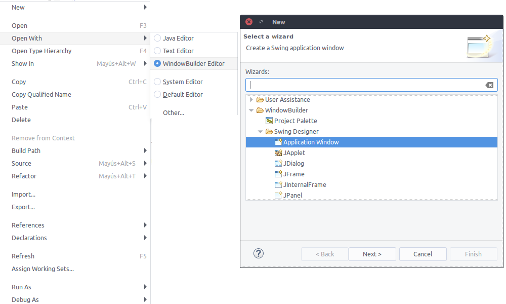
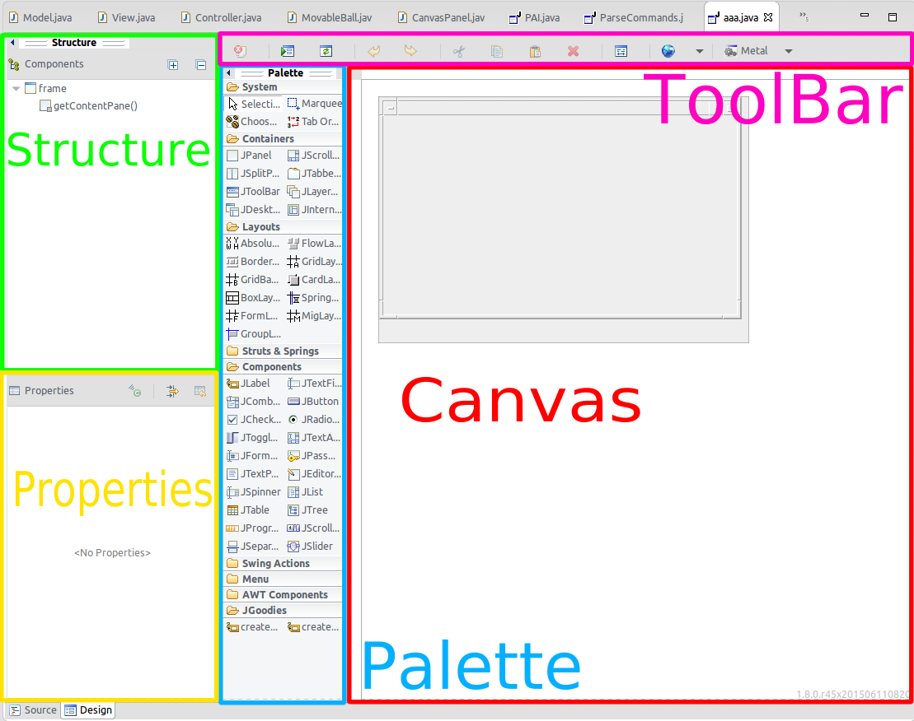
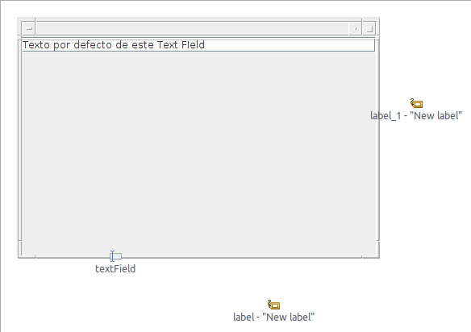
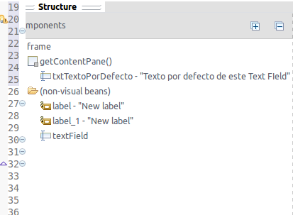

# Visual tools for programing Java GUI
- Eleazar Díaz Delgado
- Daniel Darias Sánchez

---

## Index
- What are this tools and what can they do?
- WindowBuilder
    + How it works
    + Example
    + Configuration
- IntelliJ
    + How it works
    + Examples
    + Configuration
- Comparison
- Conclusions

---

## What are this tools and what can they do?

---

### GUI Designers
- Fast
- Intuitive
- Simple
- Powerful

Note: hablar de que este método es muy bueno

---

### Tools
- Inbuilt
    - IntelliJ
    - NetBeans
- Plug-in
    - WindowBuilder
    - SceneBuilder (JavaFX)

Note: Netbeans y intellij hacen del formato .form el cual es un archivo xml
      JavaFx es la siguiente generacion de intefaces que va a remplazar a swing,
      posee un editor de interfaces SceneBuilder independiente del editor de texto.
      Este hace uso del mismo metodo que intellij editando la interfaz en XML

---

## WindowBuilder

---

### How it works

- Automatically creates and read Java code
- Feedback between designer and text editor

---

### Starting Window Builder

Two ways:

- **New projects**: File > New > Other > WindowBuilder > Swing Designer
- **Existing projects**: Right click > Open With > WindowBuilder

vvv

---

### WindowBuilder Layout

---

### Example

Note: Explicar; Método initialize generado, Atributos privados generados,  Constantes incrustadas en el código, Cómo la clase no hereda de JFrame

---

### Canvas
- Shows the current interface
- Allows stretch
- Allows drag & drop

Elements dropped outside the Frame = private final

vvv

---

### Components
Tree representation of the components hierarchy

Allows drag & drop

vvv

---

### Palette

- Highly customizable
- Import / export palettes
- Import .jar
- Creates factories

vvv

---

### Example

Note: Explicar
- Importar clases desde un .jar a la paleta
- Trabajar con distintos ficheros
- Reordenar elementos en el árbol

---

### Properties
- Add listeners
- GoTo definition
- Convert Local / field
- Allows multiple elements editing

vvv

---

### Other options on the elements
- Morphing
- Expose
- Surround with
- Set Action

---

### ToolBar
- Externalize strings
- Quickly test
- Layout Assistant
- Look & Feel

vvv

---

### Example

Note: continuar con el anterior  

---

## IntelliJ designer

---

### How it works

- Bound class to form
- XML representation

vvv

Note: Como este basicamente trabaja comparado a WindowBuilder, la conexión entre la ui XML y la clase

---

### First steps

- Over existing project
- Or new project
- **No matters**

Note: El proceso es el mismo, solo mostrar como se puede generar un archivo gui
      saltar a la presentación para ver la distribución. Generar un nuevo gui status2

---

### Layout Distribution

Note: Prácticamente se distribuye igual que WindowBuider

---

### Practical example

- A simple GUI Telephone

Note: Con el gui explicar qué contiene la clase y cómo es enlazado el forma la clase Java
      Mostrar el xml correspondiente.
      Saltar a la clase Keyboard.
      Mostrar el designer.
      Explicar las properties.
      Explicar los layout y como utilizarlos selecionarlos .diffiere
      Listerner
      Morphing
      Preview

---

### Elements from practical example

- Properties
- Morphing
- Listener
- Custom Palette
- Instant preview

---

### Multilingual GUI

- Locals
- Configuration

Note: Se va muestra como se crea un recurso para los Locales
      Como editarlos.
      Switchear entre ellos
      Explico el main y setLocale.
      Añado traduccion al boton añadido anteriormente

---

### JDialog

- What it is
- `dispose` to close it

Note: Un simple diálogo predefinido. Usar dispose para cerrarlo y no setVisible(false)

---

### Configurations of designer

- Generate code in bytecode
- Generate code in Java class
- Other defaults

---

## Comparison

|                            | IntelliJ | WindowBuider |
|----------------------------|----------|--------------|
| Method                     | XML      | Java Code    |
| Workflow                   | Fast     | Not so Fast  |
| Stability                  | Stable   | Unstable     |
| Wrong Code                 | Works*   | Not works    |
| Work with "hand made" code | No**     | Yes          |
|                            |          |              |

- \* Because the .form file will be always correct
- \*\* Works with "hand made" code but it can't be edited with designer.

Note: El segundo se puede trabajar con el codigo anterior lo que no se puede es editar con el designer del intellij
      Se puede incluir como un componente en la paleta. Pero hasta ahi.

---

## Questions?

---

## Links & References

- [Repo with GUI using WindowBuilder](https://github.com/EleDiaz/PAI-WindowBuilder)
- [Repo with GUI using IntelliJ](https://github.com/EleDiaz/PAI-UI-Designer)
- [WindowBuider](https://eclipse.org/windowbuilder/documentation.php)
- [Idea Docs](https://www.jetbrains.com/help/idea/15.0/designing-gui-major-steps.html)
